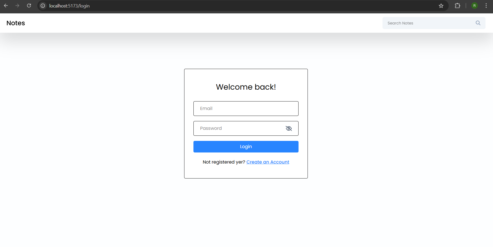
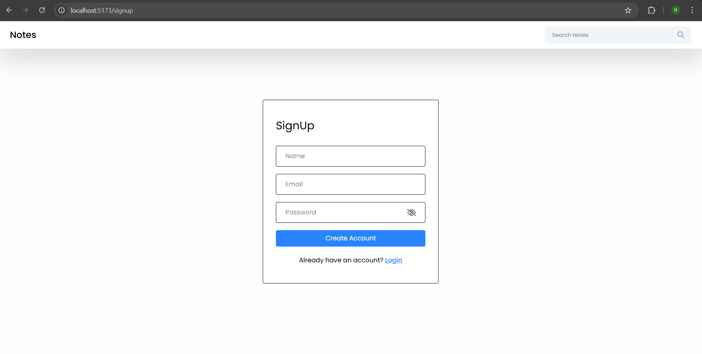
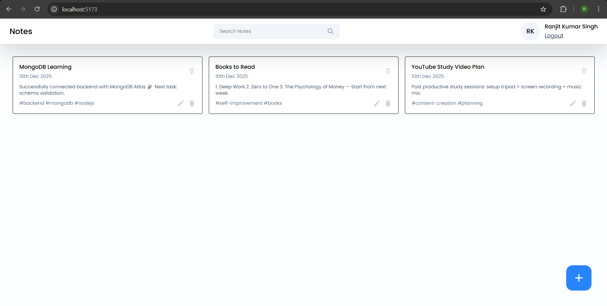
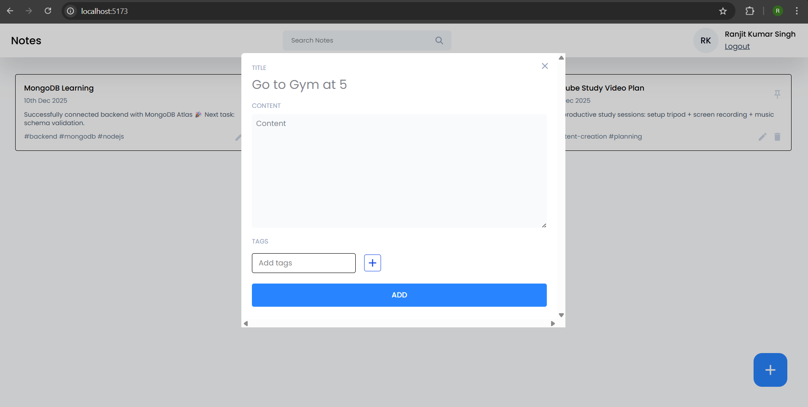
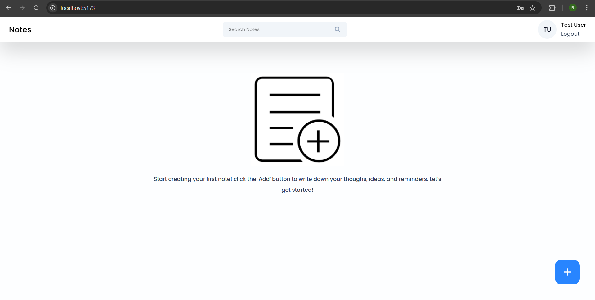

<h1 align="center">📒 Notes App - Smart Personal Notes Manager</h1>

<p align="center">
A modern & secure MERN Notes App with authentication, pinning, searching, tagging, and smooth UI 🚀
</p>

<p align="center">
  
  
  
  
  
  
</p>

---

## 📝 Overview

Notes App is a full-stack note-taking application where users can securely log in and manage notes with rich features like:

✔ Add / Edit / Delete notes  
✔ Search by title or content  
✔ Pin important notes  
✔ Use tags to categorize  
✔ Auto sort pinned notes on top  
✔ Cloud storage using MongoDB Atlas  
✔ Clean and responsive UI  

Perfect for everyday productivity ✨

---

## 🔐 Authentication Flow

- JWT-based secure login & signup
- Private routes to protect dashboard
- User-specific data isolation

---

## 🚀 Features

| Feature | Description |
|--------|-------------|
| Authentication | Login / Signup with JWT |
| Add Note | Create notes with tags |
| Edit Note | Update content anytime |
| Delete Note | Remove unnecessary notes |
| Pin Note | Keep important notes on top |
| Search | Find notes instantly |
| Tags Support | Categorize & filter |
| Responsive UI | Works on all screens |

---

## 🧰 Tech Stack

| Layer | Technologies |
|------|--------------|
| Frontend | React, Axios, Tailwind CSS |
| Backend | Node.js, Express.js |
| Database | MongoDB Atlas |
| Auth | JSON Web Tokens (JWT) |
| State Mgmt | React Hooks |
| Utils | bcrypt / cors / mongoose / dotenv |

---

## 📸 Screenshots


### 🔐 Login


### 📝 Signup


### 📚 Notes Dashboard


### ➕ Add Note Modal


### 🌱 Empty State


---

## 📂 Project Structure
````
Notes-App/
│
├── Backend/ # Express + MongoDB API Server
│ ├── models/ # Mongoose schemas (User, Note)
│ ├── index.js # Main server + API routes
│ ├── utilities.js # JWT auth middleware
│ ├── package.json # Backend dependencies & scripts
│ └── .env # Environment variables (ignored in Git)
│
└── Frontend/ # React UI (Vite + Tailwind)
├── src/
│ ├── pages/ # Login, Signup, Home pages
│ ├── components/ # Navbar, NoteCard, Toast, etc.
│ ├── utils/ # Axios instance (API base config)
│ ├── App.jsx # Routing setup
│ └── main.jsx # React entry point
├── public/
├── package.json # Frontend dependencies & scripts
└── vite.config.js # Vite configuration

````
